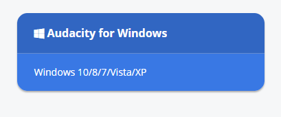
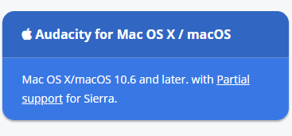

# How To Use Audacity 
### Written By: Kyle Rosswick
### Date: 7/24/2018
### Paw Print: klrmt5
### Class: INFOTC 2600
---
## Navigate this page
#### Go To
Step 1: [What it's about](https://github.com/krosswick/Tutorial/edit/master/README.md)

Step 2: [Target Audiance](https://github.com/krosswick/Tutorial/edit/master/README.md)

Step 3: [Download Audacity](https://github.com/krosswick/Tutorial/edit/master/README.md)

---
## What it's about:
>This tutorial is designed to give you a basic understanding of how to set up and use basic functions that Audacity offers. **This includes:**
>* Downloading Audacity
>* Recording audio clips
>* Editing those audio clips
>* How to import audio
>* How to export audio
---
---
## Target Audiance:
>This is designed to be a very basic tutorial, giving new users a first look at the tools that Audacity provides. **Users who will benefit include:**
>* All age groups
>* First time Audacity users
>* People with limited technical skills
---
---
## Download Audacity:
**To get Audacity downloaded on your computer**
>Go to Audacity's website.  You can simply google "Audacity download" or you can click [this link](https://www.audacityteam.org/) to get to the website.
>
>Once at the website, there will be a large blue button in the center of the screen that says "Download Audacity". The button looks like this 
>
>
>
>
>
>This button will redirect you to a page that prompts you to download Audacity based on what operating system you are using.

**If you are using windows**
>* Click this button:
>
>
>
>
>
>Next, click Audacity 2.2.2 installer.
>Once it has downloaded choose your language and your file path.

**If you are using Mac**
>* Click this button:
>
>
>
>
>
>Next, click Audacity 2.2.2 .dmg file.
>Once it has downloaded, choose your language and your file path.
---
---

