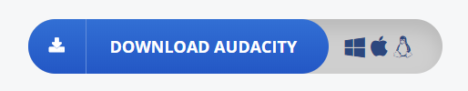

# How To Use Audacity 
### Written By: Kyle Rosswick
### Date: 7/24/2018
### Paw Print: klrmt5
### Class: INFOTC 2600
---
## Navigate this page
#### Go To
Step 1: [What it's about](#What-it's-about)

Step 2: [Target Audiance](#Target-Audiance)

Step 3: [Download Audacity](#Download-Audacity)

Step 4: [Recording Audio](#Recording-Audio)

Step 5: [Exporting Audio](#Exporting-Audio)

Step 6: [Importing Audio](#Importing-Audio)

---
## What it's about <a id="What-it's-about"> <\a>
>This tutorial is designed to give you a basic understanding of how to set up and use basic functions that Audacity offers. **This includes:**
>* Downloading Audacity
>* Recording audio clips
>* Editing those audio clips
>* How to import audio
>* How to export audio
---
---
## Target Audiance <a id="Target-Audiance"> <\a>
>This is designed to be a very basic tutorial, giving new users a first look at the tools that Audacity provides. **Users who will benefit include:**
>* All age groups
>* First time Audacity users
>* People with limited technical skills
---
---
## Download Audacity <a id="#Download-Audacity"> <\a>
**To get Audacity downloaded on your computer**
>Go to Audacity's website.  You can simply google "Audacity download" or you can click [this link](https://www.audacityteam.org/) to get to the website.
>
>Once at the website, there will be a large blue button in the center of the screen that says "Download_Audacity". The button looks like this 
>
>
>
>
>
>This button will redirect you to a page that prompts you to download Audacity based on what operating system you are using.

**If you are using windows**
>* Click this button:
>
>
>
>
>
>Next, click Audacity 2.2.2 installer.
>Once it has downloaded choose your language and your file path.

**If you are using Mac**
>* Click this button:
>
>
>
>
>
>Next, click Audacity 2.2.2 .dmg file.
>Once it has downloaded, choose your language and your file path.
---
---
## Recording Audio <a id="#Recording-Audio"> <\a>
>Once you open up Audacity, you should see the main interface that looks like this:
>
>
>
>
>
>
>At this point, make sure you have a recording device plugged into your computer so you can record audio.
>To begin recording, you can simply click on the red circle button at the top left of the screen depicted here:
>
>
>
>To stop recording, navigate back to the tool bar depicted above and click the gray square button.
>
>**Congratulations!** You have just recorded your first clip of live audio!
---
---
## Exporting Audio <a id="Exporting-Audio"> <\a>
>Now that you have a clip recorded, you will want to export it so you can use it however you please.
>
>At the top left of the screen you will find a button titled "flie". Click file -> Export -> Export as WAV -> Save.
>
>After this is completed this screen will pop up:
>
>
>
>
>
>From here, you can edit the file to have the title and description that you desire.
>
>After clicking OK, you will be able to find your exported audio in your Audacity folder.
>
>**Congratulations!** You have exported your first audio clip to a WAV file!
---
---
## Importing Audio <a id="#Importing-Audio"> <\a>
>If you have an audio file that you wish to import to Audacity, the process is very simple and easy to follow.
>
>Go to the top left of the screen and click file -> Import -> Audio...
>
>A new screen that looks like this will pop up:
>
>
>
>
>
>From here, you can look through the files that you have saved to your computer and find the clip of audio that you wish to import.
>
>Click the file, and select OK when the warning box pops up.
>
>**Congratulations!** You have imported an audio clip into Audacity!
